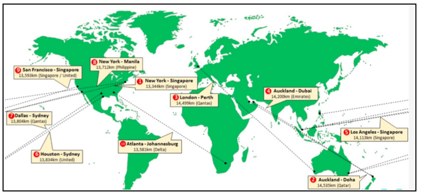

## Problem Statement - Route Planner

In this challenge you will get to tackle a problem that many companies face on a day-to-day basis. How to do optimal route planning. This may involve finding the shortest route (measured by distance) between two cities, or finding the route that will take the shortest time (assuming that the same mode of transport is used) or the route that will involve the lowest cost.
Your knowledge of several key concepts & how to apply them will be fully tested. Typically, at this stage of your learning you will be expected to demonstrate your ability to use concepts such as :
-	Aggregating, storing, and manipulating data in Arrays

-	Modularization i.e. breaking down the solution into discrete components that do precisely defined tasks. Ensuring that your design results in modules that have high cohesion and low coupling


<div align="center">
 
</div>

In the picture above, air routes connecting various cities are shown. In this picture only the distance in kms is shown, but information is typically available for the flight time as well as the cost. It is possible to capture this information in a pre-agreed format. For example:
-	Source City, Destination City, Distance in kms, Typical flight time, Typical ticket cost

So, for example the information for Delhi-Mumbai could be represented as:
-	Delhi, Mumbai, 1148, 2:10, INR6000

Similarly, the information for Delhi-London is:
-	Delhi, London, 6704, 8:55, INR37000

Some more examples:
-	Frankfurt, London, 660, 1:25, EUR155
-	London, New York, 5585, 7:45, GBP280
-	New York, San Francisco, 4130, 6:10, USD147
-	London, San Francisco, 8620, 11:05, GBP345
-	Frankfurt, San Francisco, 9136, 11:30, EUR529

Consider, a single dimensional array of strings, in which each element of the array represents one such route. For example, the string for the Delhi-Mumbai route will be: 
-	“Delhi, Mumbai, 1148, 2:10, INR6000”, and
-	“London, San Francisco, 8620, 11:05, GBP345” for the London-San Francisco route

In this multi-part programming challenge, you are required to do the following:


## Task 1 	
Write a program to interactively accept input from the user on popular routes covering 15 cities. Store the route 
information for each route in an array called `routes[]`. Each element of the array will be a string as 
described in the example earlier. 

Note it is important that the strings are formatted correctly. Some of the points to be taken care of are:
- Commas are used to separate the individual items of information regarding a route
- There should be no space preceding a comma
- There should be exactly one space after a comma
- Each word of the city name should be Init Caps. For example, New York, Delhi, Los Angeles, etc.
- The distance in kilometres should be indicated by a non-zero positive integer
- The travelling time by air between 2 cities has to be in hh:mm format
- The cost of the airfare must be preceded by a 3-letter code commonly used to indicate the currency. For 
example, INR for Indian Rupee, USD for US Dollar, GBP for Great Britain Pound, EUR for Euro etc. `You can 
refer to the ISO Standard 3 letter currency code here: https://www.xe.com/iso4217.php`
- The cost of the air fare should be a non-zero positive integer
 
At the end of the data entry process, print out the route information in a tabular format as follows:

### Route Information – Some Popular Routes

```
SNo.		From		To		Distance in Kms		Travel Time	Typical Airfare
1.		Delhi		Mumbai	        1148			2:10		INR 6000
2.		Delhi		London		6704			8:55		INR 37000
3.		Delhi		Frankfurt	6117			8:35		INR 32000
4.		Frankfurt	London		660			1:25		EUR 155
....
....
15.		Los Angeles	Tokyo		8773			11:15		USD 520
```

## Task 2:
	
Now that you can accept route information from the user and store it in an array, you need to be able to 
use this information in helping the users plan their trips. Write independent functions to respond to the 
following user queries:

Given the name of a city, show a list of other cities to which it has direct flights. If you do not have 
any information about the city mentioned by the user, give an appropriate message. For example:
“We are sorry. At this point in time we do not have any information on flights in the specified route”
So, for example, if the user has specified “Delhi”, the output shown will be:

```
SNo.		From		To		Distance in Kms		Travel Time	Typical Airfare
1.		Delhi		Mumbai	        1148			2:10		INR 6000
2.		Delhi		London		6704			8:55		INR 37000
3.		Delhi		Frankfurt	6117			8:35		INR 32000
```

Use the following function definition:
		```String[]	showDirectFlights(String[] routeInfo, String fromCity)```

## Task 3:
If you look closely, at the output produced by the function in `showDirectFlights()` you will notice, 
that the destination cities are appearing in no particular order. Perhaps, that was the sequence in which 
the user entered the data and hence that was also the way in which it was stored in the `routes[]` array.
Refactor the function so that it lists the destination cities in alphabetical order. For the earlier 
example, the resultant output should be:

```
SNo.		From		To		Distance in Kms		Travel Time	Typical Airfare
1.		Delhi		Frankfurt	6117			8:35		INR 32000
2.		Delhi		London		6704			8:55		INR 37000
3.		Delhi		Mumbai	        1148			2:10		INR 6000
```
## Task 4: 
Given the name of a city and the name of a destination city, analyse the available route information 
and confirm if the 2 cities are connected by air routes or not. If it is possible to travel between the 2 
cities by air, show the corresponding route information. Note that there may be direct routes available as 
well as routes that require connections through intermediate cities. List the direct routes first, and then 
show the routes with in-between connections. 

For example, if the user wishes to travel from Delhi-London, (based on the actual data) the result may be:
```
SNo.		From		To		Distance in Kms		Travel Time	Typical Airfare
1.		Delhi		London		6704			8:55		INR 37000
2.		Delhi		Frankfurt	6117			8:35		INR 32000
		Frankfurt	London		660			1:25		EUR 155
3.		Delhi		Mumbai	        1148			2:10		INR 6000
		Mumbai	        London		7187			9:30		INR 28000
```

If there are no flights connecting the 2 cities, display an appropriate message.
Use the following function definition:

```java
String[] showAllConnections(String[] routeInfo, String fromCity, String toCity);
```

### Task 5:
You would have noticed a user-unfriendly issue with the output produced above. It leaves the user to 
calculate the total flight time for routes that are not direct. Refactor, the function so that for routes 
with one or more stops, the total flight distance, time, and cost is also shown. 
The improved output should be as follows:

```
SNo.		From		To		Distance in Kms		Travel Time	Typical Airfare
1.		Delhi		London		6704			8:55		INR 37000
2.		Delhi		Frankfurt	6117			8:35		INR 32000
		Frankfurt	London		660			1:25		EUR 155
				Total		6777			10:00		INR 45437
3.		Delhi		Mumbai	        1148			2:10		INR 6000
		Mumbai	        London		7187			9:30		INR 28000
			        Total		8335			11:40		INR 34000
```
Note: In this case we had to convert the fare from Frankfurt-London which was in Euros to Indian Rupees before computing the total fare in Indian Rupees. Use an appropriate currency converter function to do currency conversions as & when required.

