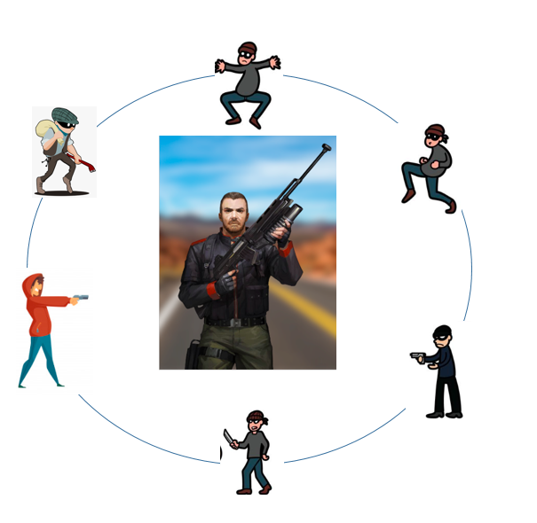

## Problem Statement - Robber Shootout

Sam Jones, a diamond merchant of WestVille is going to the city to sell his diamonds. on his way, robbers attacked him on highway and encircled him.

So, now he is trapped in the middle of a circle of robbers. There is no way of escape except by shooting out the enemies one by one. Sam must calculate the following before he begins shooting so that he can save his life.
•   The number of enemies he is surrounded by
•   Who will be his first target

<div align="center">
 
</div>


The hero must also keep track of how many live targets he has missed during the shootout so that he can gauge whether he needs to take out another shot or not. 

Finally, Sam could shoot all of the robbers, and then he continued on his way to the city.
 
Write a Java program for this shoot out game. Display the sequence in which the shootout has happened. 

Please consider the following: 
- the number of robbers are dynamic and needs to be accepted from the user
- the user needs to provide the input on which robber should Sam start shooting with.
- As Sam is moving and shooting at the same time, he can skip few robbers in one iteration. But this gap would be uniform for all the cases.

### Sample Input:

```
Enter No. of Robbers:
10
Enter The Robber with whom Sam will start shooting:
2
Enter the gap between the robbers:
3
```

### Sample Output:
```
Target = 2, 1 shots completed
Target = 6, 2 shots completed
Target = 10, 3 shots completed
Target = 5, 4 shots completed
Target = 1, 5 shots completed
Target = 8, 6 shots completed
Target = 7, 7 shots completed
Target = 9, 8 shots completed
Target = 4, 9 shots completed
Target = 3, 10 shots completed
10 shots taken

The shootout sequence was: 
2,6,10,5,1,8,7,9,4,3
```
