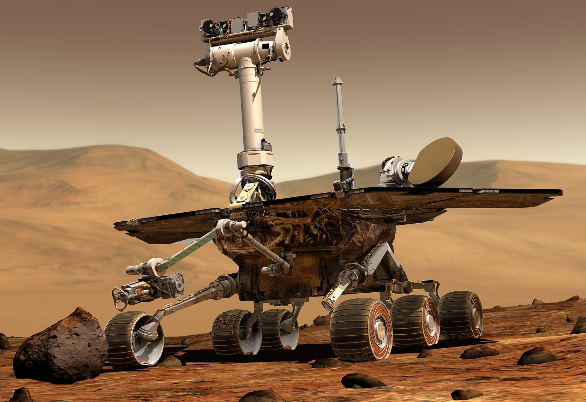
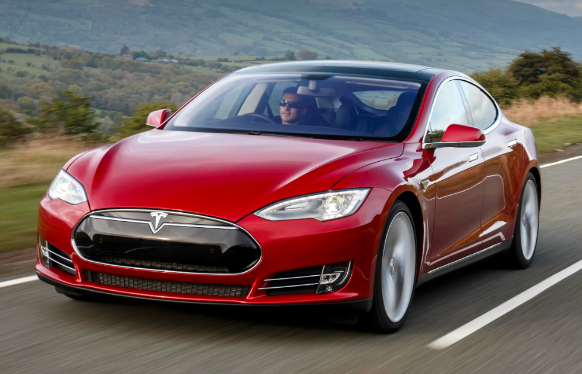
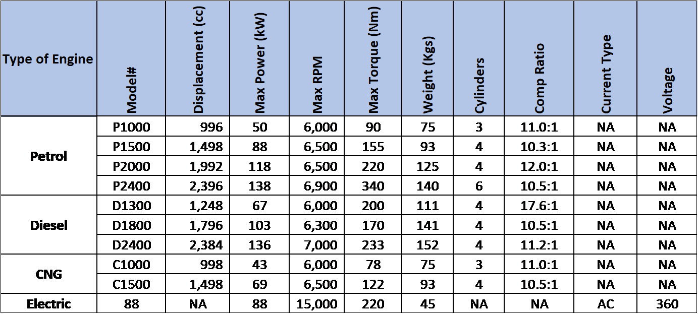

# Problem Statement – The World of Vehicles

**Background** – A vehicle is a machine that transports people or goods. Intuitively we can recognize vehicles when we see them. From Moon buggies of the 1970’s to the Mars rover, to the more down to earth scooters, motorcycles, autorickshaws, cars, buses, and trucks – we are surrounded by vehicles in our everyday life. But vehicles are not just limited to the land. Vehicles include watercraft such as boats and ships, as well as aircraft and spacecraft.  There are even amphibious vehicles that can transition from land to water and vice-versa. And of course, we had the iconic Space Shuttle that was both an aircraft as well as a spacecraft. 

As you can begin to see, modelling the world of vehicles is not a simple task. What all types of vehicles you should consider in your model, depends upon the problem you are trying to solve. If you try and include each type of vehicle, your design effort will be very time consuming and may result in complexity that is not justifiable in the context your program needs to operate in. 

So, for example, an application for the defence forces may have to deal with very unconventional specifications and applications. The vehicle may be defined by its offensive or protective capabilities.  For example, a main battle tank is very different from an armoured personnel carrier. In the former, it is the size of the main gun, type of ammunition, protective armour, size of the crew, etc. that will be most important. But in the latter, it may be the number of soldiers who can be transported that will be critical. Yet both will have several common characteristics dealing with speed, maximum range, maximum weight, type of fuel, depth of water they can pass through, etc.

An application for a Space research organization such as NASA or ISRO will have to deal with vehicles that are truly unique. They may have very different configurations, propulsion technology, etc.   A program design that was done for a conventional civilian land vehicle application, would probably be totally inadequate for an organization dealing with space vehicles.  For example, a space vehicle may have life support equipment onboard – and one of the critical attributes maybe the time that it can support passengers in a hostile-non breathable atmosphere or the vacuum of space. For example, on the moon, which does not have any breathable atmosphere. Or the ability to withstand wide ranges of temperatures - temperatures on the moon range from extremely hot, up to 123C (253F) when the sunlight hits the moon’s surface, to a freezing cold -153C (-243F) on the dark side. 

Space agencies have pioneered the use of remote-control technologies in vehicles. Over the years these technologies have come into the mainstream civilian vehicles and connected cars are going to be the way of the future. In fact, it is said that modern cars have almost as much computer hardware & software as the mechanical hardware. Some even describe cars such as the Tesla as “computers on wheels”.

**A leading vehicle manufacturer, Luxtech, has announced a competition to decide on the design of its next generation Remote Vehicle Monitoring System. The company manufactures a range of passenger cars based on several different engine and transmission configurations. Additionally, the cars are available in several different body types and seating capacities. Your design will have to cater to the many variations that are possible. In this challenge you have decided to participate in this design competition and create a proof-of-concept prototype to demonstrate the power of your design.**
 

**Challenge – Part 1**

The heart of a vehicle is an engine. Not surprisingly, Luxtech has a competitive family of vehicle engines. Since, these engines must power a range of vehicles, and different kinds of customers want different kinds of engines, Luxtech has developed engines that use different kinds of propulsion technologies/fuels. The most prevalent engines are Internal Combustion Engines. Internal combustion engines vary based on the fuel they use. There are petrol engines, diesel engines, and compressed natural gas (CNG) engines for the environmentally conscious customers. And for those who believe in zero emissions, Luxtech has recently launched electric engines too. In fact, Luxtech has even launched a hybrid vehicle that is based on a combination of petrol & electric engines. 

No matter what the type of engine, there are some specification characteristics that all of them share. For example:	
-	Maximum Power Rating	- In kW or Horsepower (HP)
-	Maximum Torque			- In Newton-metres (Nm)
-	Maximum RPM				- RPM
-	Weight					- In Kgs
etc.

However, there are some characteristics that are unique to different engine types. For example:

*Internal Combustion Engines*
- Number of Cylinders - Integer – typically 3, 4, 6, or 8
- Displacement - Total volume of all the cylinders in litres (l) or cubic cm (cc)
- Compression Ratio		- 10.8:1 or 18:1, etc.

*Electric Engines*
- Current Type			- AC or DC
- Voltage				- Integer in Volts

**Table 1**, shown below lists the various types of engines offered by Luxtech along with their specifications.

**Task 1 –** 

Analyse the family of car engines produced by Luxtech and create an appropriate hierarchy of classes that can be used to model the various engines. Let the parent class in the family be named Engine. You have to determine the other child classes in this family based on the description of the family of Luxtech engines described above and the information presented in Table 1. Create appropriate constructors for each of the classes identified by you so that engine objects of various types can be instantiated as per the specifications in the table given above. The constructor should take an engine model number as a parameter and initialize all the relevant specifications for that engine type as per the specifications given in Table 1.

**Task 2 –** 

Now write a method named showSpecs() which can be invoked for any engine type to display the specifications of a particular engine object. The engine specifications should be displayed as follows:

    Engine Type         :  Type of Engine
    Engine Power Source : Fuel Type/Electric Battery
    Model Number        : Engine Model #

Key Specifications:

    1.	<Specification Name 1> 		<Specification Value>
    2.	<Specification Name 2>		<Specification Value>
    …

So, for example, for an object that is a Petrol 2000 model the specifications will be displayed as:

    Engine Type         : 	    Internal Combustion	
    Engine Power Source :		Petrol
    Engine Model Number :		P2000

**Key Specifications:**

1.	Displacement:			1992 cc
2.	Max Power:				118 kW	(158 HP)		
3.	Max RPM:				6500
4.	Max Torque:			220 Nm
5.	Weight:				125 Kgs
6.	Power to Weight Ratio:		1264 HP/Ton
7.	Number of Cylinders:		4
8.	Compression Ratio:			12.0:1

---------
Write a **main()** method to test the class hierarchy by declaring various kinds of engine objects and showing their specifications.

