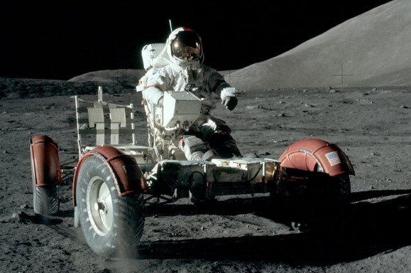
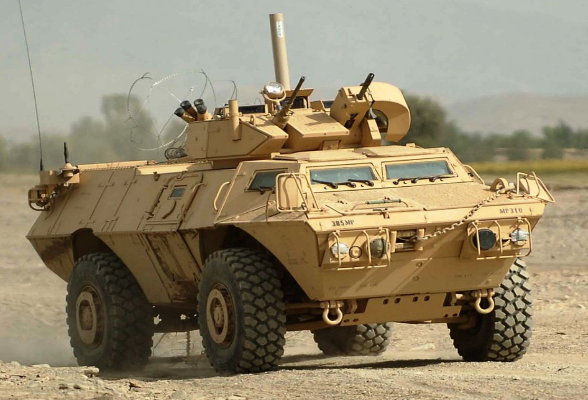
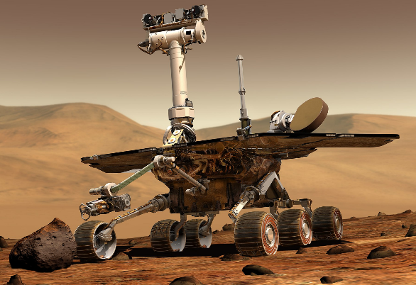
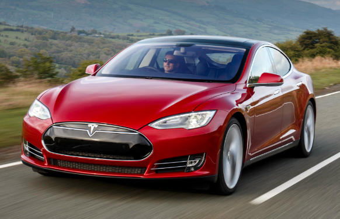
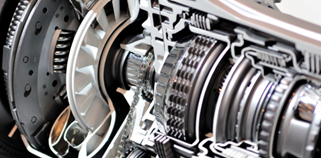

# Problem Statement – The World of Vehicles

**Background** – A vehicle is a machine that transports people or goods. Intuitively we can recognize vehicles when we see them. From Moon buggies of the 1970’s to the Mars rover, to the more down to earth scooters, motorcycles, autorickshaws, cars, buses, and trucks – we are surrounded by vehicles in our everyday life. But vehicles are not just limited to the land. Vehicles include watercraft such as boats and ships, as well as aircraft and spacecraft.  There are even amphibious vehicles that can transition from land to water and vice-versa. And of course, we had the iconic Space Shuttle that was both an aircraft as well as a spacecraft. 

As you can begin to see, modelling the world of vehicles is not a simple task. What all types of vehicles you should consider in your model, depends upon the problem you are trying to solve. If you try and include each type of vehicle, your design effort will be very time consuming and may result in complexity that is not justifiable in the context your program needs to operate in. 

So, for example, an application for the defence forces may have to deal with very unconventional specifications and applications. The vehicle may be defined by its offensive or protective capabilities.  For example, a main battle tank is very different from an armoured personnel carrier. In the former, it is the size of the main gun, type of ammunition, protective armour, size of the crew, etc. that will be most important. But in the latter, it may be the number of soldiers who can be transported that will be critical. Yet both will have several common characteristics dealing with speed, maximum range, maximum weight, type of fuel, depth of water they can pass through, etc.

An application for a Space research organization such as NASA or ISRO will have to deal with vehicles that are truly unique. They may have very different configurations, propulsion technology, etc.   A program design that was done for a conventional civilian land vehicle application, would probably be totally inadequate for an organization dealing with space vehicles.  For example, a space vehicle may have life support equipment onboard – and one of the critical attributes maybe the time that it can support passengers in a hostile-non breathable atmosphere or the vacuum of space. For example, on the moon, which does not have any breathable atmosphere. Or the ability to withstand wide ranges of temperatures - temperatures on the moon range from extremely hot, up to 123C (253F) when the sunlight hits the moon’s surface, to a freezing cold -153C (-243F) on the dark side. 

Space agencies have pioneered the use of remote-control technologies in vehicles. Over the years these technologies have come into the mainstream civilian vehicles and connected cars are going to be the way of the future. In fact, it is said that modern cars have almost as much computer hardware & software as the mechanical hardware. Some even describe cars such as the Tesla as “computers on wheels”.

**A leading vehicle manufacturer, Luxtech, has announced a competition to decide on the design of its next generation Remote Vehicle Monitoring System. The company manufactures a range of passenger cars based on several different engine and transmission configurations. Additionally, the cars are available in several different body types and seating capacities. Your design will have to cater to the many variations that are possible. In this challenge you have decided to participate in this design competition and create a proof-of-concept prototype to demonstrate the power of your design.**
 

**Challenge – Part 2**

In order to harness the power of an engine and transmit it to the wheels smoothly, a vehicle needs a transmission. The transmission allows the engine to operate at its optimal speed (in rpm) to ensure fuel efficiency & minimal emissions while allowing the driver to operate the vehicle at the desired speed (in kmph).  While modern transmissions can be very complex, they essentially contain a set of gears or equivalent mechanical devices which allow the rotational speed and power of the engine to be transmitted to the wheels. 

Luxtech has developed a number of transmissions to suit the variety of engine families and types of passenger vehicles it produces. Affordable entry level cars are typically fitted with manual transmissions, while the more expensive cars have automatic transmissions. A category that has been introduced in between is referred to as an Automated Manual Transmission (AMT). Further, there are multiple types of automated transmissions that have been developed by the automobile industry – torque converters, continuously variable transmissions (CVT), and dual-clutch automatic transmissions (DCT). Luxtech offers both 6-speed CVT’s as well as 8-speed DCT’s. 

The full range of transmissions offered by Luxtech, along with their specifications, is shown in Table 2 below.

     

### **Task 3 –** 

Analyse the family of car transmissions produced by Luxtech and create an appropriate hierarchy of classes that can be used to model the transmissions. Let the parent class in the family be named Transmission. You have to determine the other child classes in this family based on the description of the family of Luxtech transmissions described above and the information presented in Table 2. Create appropriate constructors for each of the classes identified by you so that transmission objects of various types can be instantiated as per the specifications in the table given above. The constructor should take a transmission model number as a parameter and initialize all the relevant specifications for that transmission type as per the specifications given in Table 2.

### **Task 4 –** 

Now write a method named showSpecs() which can be invoked for any transmission type to display the specifications of a particular transmission object. The transmission specifications should be displayed as follows:

    Transmission Type: <Type of Transmission>			
    Model Number: <Transmission Model #>

    Key Specifications:

    3.	<Specification Name 1>		<Specification Value>
    4.	<Specification Name 2>		<Specification Value>
    …

So, for example, for an object that is an AMT D5 model the specifications will be displayed as:

    Transmission Type: 			Automated Manual		 
    Transmission Model Number:		AMTD5

    Key Specifications:

    1.	Forward Gears:			5
    2.	1st Gear Ratio:			2.950		
    3.	2nd Gear Ratio:			1.940
    4.	3rd Gear Ratio:			1.340
    5.	4th Gear Ratio:			1.000
    6.	5th Gear Ratio:			0.630

Write a **main()** method to test the class hierarchy by declaring various kinds of transmission objects and showing their specifications.
