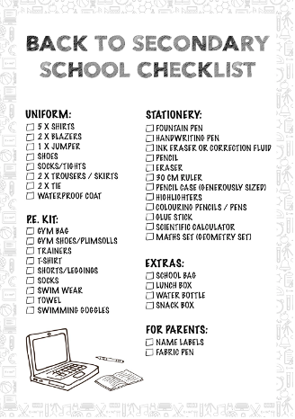

# Problem Statement – Text Analyzer

Making lists is a routine activity in our daily lives. During the week we may make a list of things to be purchased over the weekend. Or it may be a list of people we wish to invite for dinner. In its simplest form a list consists of a series of items ordered sequentially. A simple list of names could look like:

1.	Michael Jackson
2.	Tracy Chapman
3.	Taylor Swift 
4.	Paul McCartney
5.	Kishore Jumar

A phone list could look like (phone numbers have been masked):

1.	Sachin G	98101XXX76
2.	Ajay M		98210YYY45
3.	Priya A		98110ZZZ32
4.	Barry L		617XYZ2315
5.	Deepak V	510ABC3216

And a more complex list - for example, a shopping list could look like:

1.	Tomato Ketchup	- 2 bottles of 1Kg
2.	Milk			- 2 packs of 1 Litre
3.	Yellow Butter		- 1 pack of 500 gms
4.	English Breakfast Tea	- 1 box of 100 teabags
5.	Strawberry Jam		- 1 bottle of 500 gms

Note in each case there is a sequential ordering and each item in any of the 3 lists above has a similar structure. The structure of the third list will require some thought to arrive at a generic structure for a “grocery shopping item”.

## Challenge – Part 1

In this challenge you will use singly linked lists to implement a Text Analyzer. In the current age of word processors, it is so simple to look at the bottom of the screen and immediately come to know how many words we have typed in our document. Or how many characters we have used. How exactly is this done ? You will find out some of the basic building blocks for yourself as you tackle this challenge.

**Task 1** – Design a class called **Word** that can be used to store details of a word that is read from a text file. Apart from the word itself, the class should have an attribute to store the number of times the same word occurs in the file. Define appropriate constructors and getter & setter methods for this class.

**Task 2** – This task involves reading a text file and creating a word list by using a singly linked list data structure. Your word list will consist of objects of the type **Word** defined in Task 1. You should take care to ensure that no word is repeated in the list. Instead, if a word that already exists in the list is found, simply increment the word count. Once, you have read all the words in the file, use a method called **showWordList()** to show all the words that have been found along with their frequency.

**Task 3** – Notice in the output displayed in Task 2, that the words are not shown in any specific order. They are simply displayed in the order in which they were found in the file. Now refactor your program so that the word list is constructed in such a way that the words are placed in alphabetical order starting with the word “a” (if it exists in the file). Display this sorted word list.

**Task 4** – Write a method that shows the words in your word list in reverse alphabetical order. In other words, you will need to begin with the last word in your list and display its details first. And then come backwards and show all the words in the reverse order.

**Task 5** – Write an additional method called **showFrequentWords()** that reads your alphabetically sorted word list and displays the words in descending order of frequency i.e. the word with the highest frequency is listed first, then the word with the next highest frequency, etc. If 2 words have the same frequency, they should be listed in alphabetical order.

How easy is it to accomplish this task ? How much computational effort does it require ? Use the `System.currentTimeMillis()` method from the Java util package to measure the time it takes to execute the **showWorldList()** method in Tasks 2, 3, 4 and 5 and compare the results.

